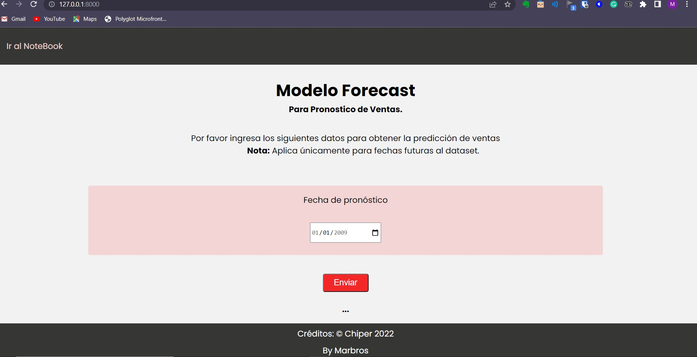

# TICKIT

## Introduction

Model sales forecasting

### 1. Creating a virtual Environment

```bash
py -m venv venv
```

Después de crear con éxito el entorno, debe activarlo usando este comando:

```bash
.\venv\Scripts\activate
```

### 2. Installing dependencies using PIP

Antes de continuar, verifique que se encuentre actualmente en el directorio `TICKIT`, que incluye el archivo `requirements.txt`. Este archivo enumera todas las dependencias requeridas y sus respectivas versiones. Ahora use el siguiente comando para instalar las dependencias requeridas:

```bash
pip install -r requirements.txt
```

Este comando puede tardar un poco en ejecutarse dependiendo de la velocidad de su conexión a Internet.

### 4. Running the project

Finalmente para correr el proyecto debe usar la sgte instrucción.

```bash
uvicorn main:app --reload
```


### 5. Result

Al final debe poder ver la siguiente pantalla




### 6. Documentation

Para ver la documentación de la API

```bash
http://127.0.0.1:8000/docs/
```